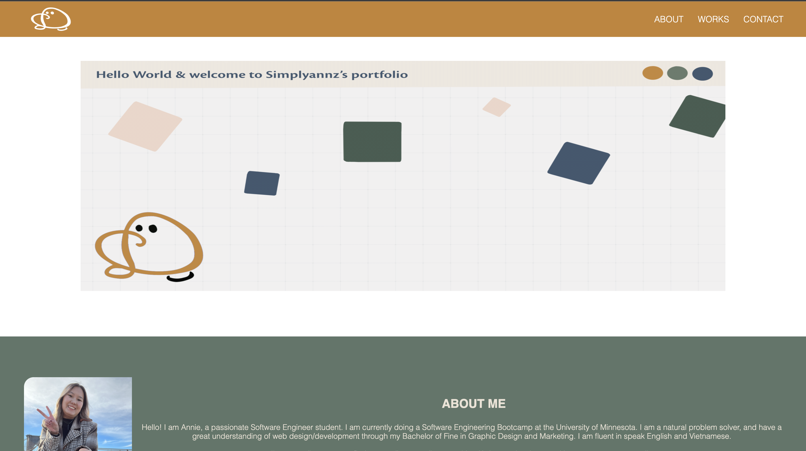
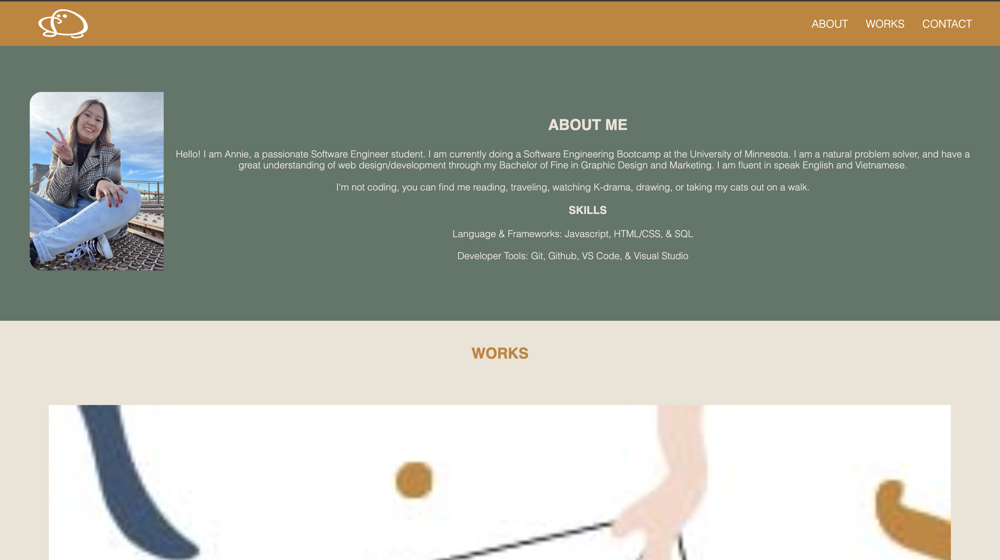
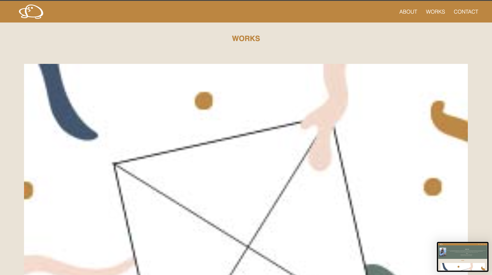
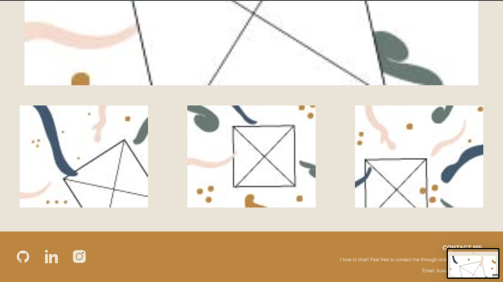

# simplyannz-web-portfolio

## Description

For my portfolio, I chose to make my website very colorful and design-like. Images and logo is the design that I did. The website has a clickable link to the different sections (about, contact, and works). The first section is about me, which has an image on the left and a text box on the right. The following section has one large image and three small images when on large devices. And the contact section is in the footer that contains social media icons and contact info—pretty simple and straightforward.

## Table of Contents

- [Installation](#installation)
- [Usage](#usage)
- [Credits](#credits)
- [License](#license)

## Installation

I used the tools that I had on my computer, like Git, Vscode, Github, and Google. First, I cloned the repo into my local file, made a GitHub repo, and named both the local and global repo the "simplyannz-web-portfolio". I opened the file in my VScode and started coding the project, and used Chrome developer tools to live to check the website for errors and stuff. Then I push it into my GitHub for deployment.

## Usage

## Credits

resources:
https://www.youtube.com/watch?v=lgX38fNbxmw
https://www.youtube.com/watch?v=jx5jmI0UlXU
https://css-tricks.com/snippets/css/a-guide-to-flexbox/
https://developer.mozilla.org/en-US/docs/Web/HTML/Element

## License

The license I choose for this project is the MIT License.

## contact me

email: anniebui0110@gmail.com
github: https://github.com/simplyannzz
